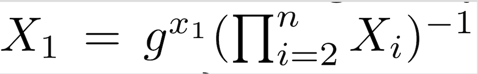
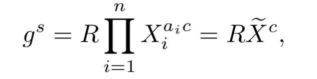
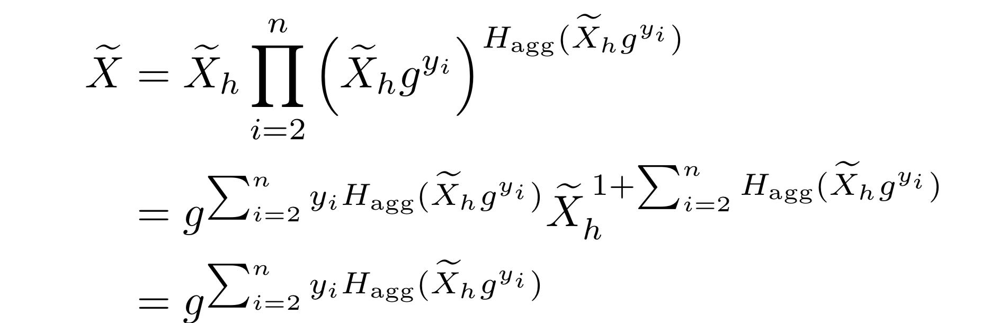

### Simple Schnorr Multi-Signatures with Applications to Bitcoin(1)

---

#### Abstract
1.新しいマルチシグなSchnorr署名の提案
  - より効率的かつシンプル
  - key aggregationの仕組みを追加（重要）
    - rogue-key attack対策

---
#### key words
- multi-signatures
- Schnorr signatures
- discrete logarithm problem（）
- forking lemma
- rogue key attack

---
#### multi-signatures
複数の署名を利用して、複数の合意が得られないと処理を進められないといった仕組み

(eg)

- メッセージｍに対してM人のうち、N人が秘密鍵で署名$\rho$	作成して合意
しかし、これでは署名者が増えるとサイズが大きくなってしまう

---
#### Schnorr signatures
- 複数の署名を一つにまとめることができる 
- 離散対数問題の困難生を利用
- *ランダムオラクルモデルにおいて選択平文攻撃にたいして存在的偽造不可

+++
- ランダムオラクルモデルとは
  - 完全なハッシュ関数

- 存在的偽造不可
  - どのような効率的なアルゴリズムも検証鍵 pk だけを用いて与えられたメッセージ m に対して妥当な署名σをつくることは不可
  
---
#### rogue-key attack

n人のグループのうちt人が敵であるとして $1 ≤ t< n$が正当なuserの$pk_1,...,pk_{n−t}$を利用して

$pk′_{n−t+1}, . . . , pk′_{n}$を計算して不正な${pk_1,...,pk_{n−t},pk′_{n−t+1},...,pk′_{n}}$

公開鍵の集合の作成を許してしまう。

---
##### Scheme of Schnorr

 a cyclic group $G$ of prime order $p$, 
 
 a generator $g$ of $G$,and a hash function $H$
 
 private/public key=$(x,X)\in {{1,2\cdots,p}}\times G$
 
 $X=g^x$
 
 
+++
 #### sign a message and checking validity
 
 signer draws a random integer $r \in Z_p$ 
 
 computes $R = g^r,c=H(X,R,m) and then, s=r+cx$
 
 The signature=$(R,s)$
 
 ##### verifying
 $g^s=RX^c$
 
---
 ##### Schnorr multi-signature scheme
  
  a group of n signers want to cosign a message m
  
  multiset of all their public key
  
  - $L={X_1=g^x_1,X_2=g^x_2,\cdots,X_n=g^x_n}$
  
+++
#### Preparetion for Signatures() 
  Each cosigner
  randomly generates and communicates to others a share Ri = gri 
  
  each of them computes 
  
  $\displaystyle R =\prod_{i=0}^n R_i ,c = H(\tilde{X}, R, m) $
  
  $\displaystyle \tilde{X}= \prod_{i=1}^n X_i$
  
  
  
+++
#### Making simple Signature
   a partial signature:$ s_i = r_i + cx_i$ 
 
 then,combined into a single signature $(R, s)$
 
 - where $\displaystyle s = \sum_{i=0}^n s_i \pmod{p}$
 
  

 
+++
 #### The validity of a signature $(R,s)$
 
 $g_{s} = R \tilde{X}$
  
 $\tilde{X} =  \prod_{i=1}^n X_i $ and $c = H(\tilde{X},R,m)$
  
$\tilde{X}$:key aggregation
  
+++
##### vulnerable to a rogue-key attack
 
a corrupted signer sets its public key to 
 
  
 
 ###### ↓

allowing him to produce signatures 

for public keys {$X_1, . . . , X_n$} by himself.
 
 
 
 
---
#### Improvement for MOR01

main idea
- to have each cosigner use a distinct “challenge” ci when computing
their partial signature $s_i = r_i + c_ix_i$, defined as $c_i = H(⟨L⟩, Xi, R, m)$

- $⟨L⟩$ is some unique encoding of the multiset of
public keys $L = \{X_1,\cdots, X_n\}$

###### HOWEVER
 NO key aggregation
 
---
### new multi-signature scheme(MuSig)

+++

##### signer computes
$c=H_{agg}(X_i,L)$

$\tilde{X}= \prod_{i=0}^n X_i^{a_i}$
  

generates a random $r_1 ← Z_p$

$R_1=g^{r_1}$,

$t_1=H_{com}(R_1)$

$t_i=H_{com}(R_i)$を確認

+++
$c=H_{sig}(R,m,\tilde{X})$ 

$\displaystyle R= \prod_{i=1}^n R_i$

$s_1=r_1+ca_1x_1 \pmod{p}$

$s_1$を他者におくり、$s_i$を受け取る

$\displaystyle s= \sum_{i=0}^n X_i^a_i$

The signature is $σ = (R, s)$

---
##### Verification

the verifier computes $a_i = H_{agg}(L,X_i)$

---
##### Simpler 

$H_{agg}(X_i)$ is insecure when
multiple keys are controlled by the attacker.

THe aggregate of just that key alone is $X = X^{H_{agg}(X_1)}$

Wagner’s algorithmをつかうと、$O(2^2\sqrt{k})$timeでrogue-key attack

---
use Wagner’s algorithm [Wag02] to find $n − 1$ integers $y_2 , . . . , y_n$
n such that $\displaystyle \sum_{i=2}^n H_{agg}(\tilde{X_hg^y_i})$

(内積？)
---
### Derandomized Signing

##### To avoid a strong random number generation  

the creation of the random values $r_i$ is often done using an algorithm 

which use determistic function(*)

(*)given a particular input, will always produce the same output

+++

Assume Alice and Bob, holding respective key pairs $(x_1,g^x_1)$ and $(x_2,g^x_2)$

Alice:R_1,Bob:R_2

+++

- Alice computes $R=R_1R_2$
               $c = H_{sig}(\tilde{X},R,m)$
               $s_1=r_1+ca_1x_1 \pmod{p}$

- Alice again sends R1. Bob responds with $R2′\neq R2$

- Alice computes $c′ = H_{sig}(\tlide{X},R_1R_2^′ ,m)$ and 

  $s′_1 = r_1 + c′a_1x_1$, and sends $s′_1$
  
- Bob can $x_1=\frac{s_1-s′_1}{a_1(c-c′)}\pmod{p} $ 

---
##### To avoid this problem

each signer must ensure that whenever any $R_j$ sent by other cosigners or the message m changes,

his ri value changes unpredictably.

randomness or a counter into the function fを導入することで解決

 
 
 
 
 
 
 

